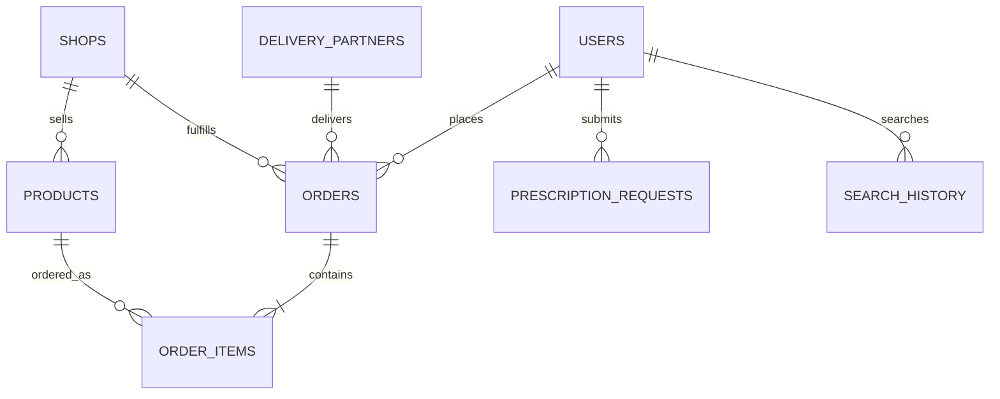

# 📖 Hamar Bazar 2.0 — Project Documentation

Welcome to the **Hamar Bazar 2.0** specifications and project documentation. This file serves as the single source of truth for the project's architecture, workflows, database configuration, security checks, and deployment setup, allowing future developers to understand, maintain, and expand the project seamlessly.

---

## 🏗️ Core Technology Stack

* **Backend Framework**: Python (Flask)
* **Database Backend**: SQLite (`marketplace.db`)
* **Frontend**: HTML5, Vanilla CSS, JavaScript, Jinja2 Templates
* **Security & Auth**: CSRF Protection (`Flask-WTF`), hashed passwords (`werkzeug.security`), role-based session validation, and brute-force protection

---

## 📂 Codebase Structure & File Guide

Here is a guide to the key files and folders in the project codebase:

### 1. Root Configuration & Logic
* **[app.py](file:///G:/Final%20Hamar%20Bazar%20Project/Hamar-Bazar-2.0/app.py)**:
  * Contains the Flask application initialization, middleware configurations, error handlers, and route definitions.
  * Implements security filters, session switching, and role-specific views (Customer, Vendor, Delivery Rider, and Super Admin).
  * Houses helper functions like image upload utilities and suspicion detection logic.
* **[database.py](file:///G:/Final%20Hamar%20Bazar%20Project/Hamar-Bazar-2.0/database.py)**:
  * Defines the database schema, table creation scripts, and data seeders.
  * Handles standard connection establishment to the local SQLite database (`marketplace.db`) with row-factory mappings.
* **[requirements.txt](file:///G:/Final%20Hamar%20Bazar%20Project/Hamar-Bazar-2.0/requirements.txt)**:
  * Lists Python package dependencies like `Flask`, `fpdf2`, and `Flask-WTF`.
* **[run.bat](file:///G:/Final%20Hamar%20Bazar%20Project/Hamar-Bazar-2.0/run.bat)**:
  * Windows utility script to set up virtual environments, install dependencies, run the database seeder, and boot up the Flask development server on port `5001`.

### 2. Frontend Templates (`/templates`)
* **[base.html](file:///G:/Final%20Hamar%20Bazar%20Project/Hamar-Bazar-2.0/templates/base.html)**: The master layouts, containing shared libraries, main stylesheets, navbar elements, and notification displays.
* **[login.html](file:///G:/Final%20Hamar%20Bazar%20Project/Hamar-Bazar-2.0/templates/login.html)**: Customer sign-in and quick registration portal.
* **[staff_login.html](file:///G:/Final%20Hamar%20Bazar%20Project/Hamar-Bazar-2.0/templates/staff_login.html)**: Staff credential gate supporting role selection (Vendor, Delivery Boy, or Super Admin).
* **[customer.html](file:///G:/Final%20Hamar%20Bazar%20Project/Hamar-Bazar-2.0/templates/customer.html)**: Customer portal allowing users to search products, add items to a cart, toggle priority shipping, upload payment slips or prescriptions, and track order timelines.
* **[vendor.html](file:///G:/Final%20Hamar%20Bazar%20Project/Hamar-Bazar-2.0/templates/vendor.html)**: Vendor control center for product listing modifications, stock toggling, prescription approvals, and order status updates.
* **[delivery.html](file:///G:/Final%20Hamar%20Bazar%20Project/Hamar-Bazar-2.0/templates/delivery.html)**: Rider interface. Handles assignment notifications, active delivery state maps, pickup OTP verification, and final delivery OTP confirmation.
* **[admin.html](file:///G:/Final%20Hamar%20Bazar%20Project/Hamar-Bazar-2.0/templates/admin.html)**: Control center. Features graphs for analytics (sales, orders, category distribution), suspicious customer auditing, user/vendor blocking controls, and database backup tools.

### 3. Static Files & Assets (`/static`)
* **[styles.css](file:///G:/Final%20Hamar%20Bazar%20Project/Hamar-Bazar-2.0/static/css/styles.css)**: Centralized vanilla CSS styling sheet containing themes, layout parameters, button designs, and animation properties.
* **`/images`**: Platform assets (category icons, logo).
* **`/uploads`**: Subdivided folders storing user uploads:
  * `/profile_pics`: Uploaded customer profile photos.
  * `/prescriptions`: Medical prescriptions uploaded for pharmacy validation.
  * `/payments`: Payment receipt screenshots uploaded by customers.

---

## 🗄️ Database Architecture

Hamar Bazar 2.0 connects to a local **SQLite** instance (`marketplace.db`).

### Schema Definition:

1. **`users`**: Customer data.
   * Attributes: `id` (INTEGER PRIMARY KEY AUTOINCREMENT), `name`, `phone` (UNIQUE), `address`, `profile_pic`, `password`, `is_blocked` (0 or 1), `is_suspicious` (0 or 1), `suspicion_reasons` (TEXT).
2. **`shops`**: Vendor configurations.
   * Attributes: `id` (INTEGER PRIMARY KEY AUTOINCREMENT), `shop_name`, `category` (UNIQUE), `commission_pct` (default `5.0`), `is_active` (0 or 1), `password`, `image_path`.
3. **`products`**: Product catalog details.
   * Attributes: `id` (INTEGER PRIMARY KEY AUTOINCREMENT), `shop_id` (FK to `shops`), `name`, `price`, `is_available` (default `TRUE`), `subcategory`, `description`, `image_path`.
4. **`delivery_partners`**: Delivery riders.
   * Attributes: `id` (INTEGER PRIMARY KEY AUTOINCREMENT), `name`, `phone` (UNIQUE), `active_orders` (tally), `availability_status` ('online'/'offline'), `cooldown_until` (TIMESTAMP), `password`.
5. **`orders`**: Transaction orders.
   * Attributes: `id` (INTEGER PRIMARY KEY AUTOINCREMENT), `customer_id` (FK to `users`), `shop_id` (FK to `shops`), `delivery_boy_id` (FK to `delivery_partners`), `total_amount`, `gst_amount`, `priority_type` ('NORMAL'/'URGENT'), `status` ('PENDING'/'ACCEPTED'/'READY_FOR_PICKUP'/'OUT_FOR_DELIVERY'/'DELIVERED'/'FAILED'), `pickup_otp`, `delivery_otp`, `payment_mode` ('COD'/'ONLINE'), `payment_screenshot`, `created_at` (TIMESTAMP), `assigned_at` (TIMESTAMP), `accepted_at` (TIMESTAMP), `ready_at` (TIMESTAMP), `delivered_at` (TIMESTAMP), `failure_reason` (TEXT).
6. **`order_items`**: Junction table for products inside an order.
   * Attributes: `id` (INTEGER PRIMARY KEY AUTOINCREMENT), `order_id` (FK to `orders`), `product_id` (FK to `products`), `quantity`, `price`.
7. **`failed_logins`**: Brute-force security monitoring.
   * Attributes: `id` (INTEGER PRIMARY KEY AUTOINCREMENT), `timestamp`, `username`, `ip_address`.
8. **`prescription_requests`**: Prescription records for medical orders.
   * Attributes: `id` (INTEGER PRIMARY KEY AUTOINCREMENT), `customer_id` (FK to `users`), `image_path`, `status` ('PENDING'/'APPROVED'/'REJECTED'), `shop_id` (FK to `shops`), `created_at`.
9. **`search_history`**: Customer keyword queries.
   * Attributes: `id` (INTEGER PRIMARY KEY AUTOINCREMENT), `customer_id` (FK to `users`), `keyword`, `searched_at`.
10. **`system_settings`**: Global configuration key-value storage.

---

## 🚦 Essential Application Workflows

### 1. Order Creation & Checkout
* Customers browse categories (e.g. Kirana, Cakes, Veggies, Pharmacy) or search keywords.
* Adding items creates a session cart. Users can opt for **Priority Delivery** (adds 18% GST surcharge or flags delivery routing).
* Checkouts support **COD** or **Online Payment** (which requires uploading a transaction receipt screenshot).

### 2. Pharmacy Prescription Workflow
* If an order is made at the **Pharmacy** store, the order is locked until a medical prescription is uploaded by the customer.
* The Pharmacy vendor reviews the uploaded prescription image under their dashboard.
* If **Approved**, the order moves to the standard vendor preparation cycle. If **Rejected**, the order is terminated.

### 3. Rider Matching & Fulfillment Cycle
* When a shop sets an order to **Ready for Pickup**, the backend automatically triggers delivery boy dispatch.
* **Rider Matching Filter**: The system looks for an online rider (`availability_status = 'online'`) who has 0 active orders and is not in cooldown (`cooldown_until < NOW()`).
* **Handshake Verification**:
  1. The vendor generates a **Pickup OTP**. The rider must input this OTP at the shop to mark the order as **Out for Delivery**.
  2. The customer has a **Delivery OTP**. The rider must input this OTP at the customer's location to mark the order as **Delivered**.

### 4. Fraud & Threat Detection Engine
* **Customer Verification (`check_and_flag_suspicious_user`)**:
  * **Pattern Auditing**: Matches name fields against typical test patterns (e.g., "test", "fake", "spam", "admin", "null", "user123").
  * **Character Check**: Flags names containing numeric or special characters.
  * **Phone Auditing**: Flags phone numbers with repeating digits (e.g. `9999999999`) or sequential placeholders (e.g. `1234567890`).
  * **Velocity/Volume Thresholds**: Flags users who place 3 or more orders in 24 hours, or whose spending exceeds ₹5,000 in a 24-hour window.
* Flagged users are shown in the **Super Admin** console with detailed reasons, allowing the admin to block them.
* Middleware (`check_user_and_shop_status`) intercepts requests on every call to verify that blocked users or inactive shops are immediately logged out and denied access.

---

## 🚀 Running the Project

### Local Development (Windows)
* Double-click [run.bat](file:///G:/Final%20Hamar%20Bazar%20Project/Hamar-Bazar-2.0/run.bat). It will install packages via pip, setup the database tables, seed initial history data, and host the app at **`http://127.0.0.1:5001`**.

---

## 📝 Developer Guidelines

When editing the codebase in the future, adhere to the following:
1. **Query Placeholders**: The database queries use standard SQLite `?` placeholders (e.g., `SELECT * FROM users WHERE phone = ?`).
2. **Schema Alterations**: If you modify the tables, update `init_db()` in [database.py](file:///G:/Final%20Hamar%20Bazar%20Project/Hamar-Bazar-2.0/database.py).
3. **Session Guards**: Always verify role states using `session.get('role')` and check against user blocking states when defining new user actions.
